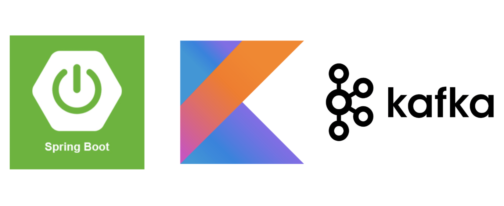

## Spring Boot Application using Kotlin and Kafka

###  Description
 A sample Spring boot application that illustration integration 
 with Apache Kafka to write Event-Driven Application.

### Functionality
A single REST-endpoint to handle requests 
and instantly fire an event. There is an event listener 
that is listening to events to process on the other side

### Kafka Configuration
``
spring.kafka.consumer.bootstrap-servers=localhost:9092
spring.kafka.consumer.key-deserializer=org.apache.kafka.common.serialization.StringDeserializer
spring.kafka.consumer.value-deserializer=org.springframework.kafka.support.serializer.ErrorHandlingDeserializer
spring.kafka.consumer.properties.spring.json.trusted.packages=com.baggio
spring.kafka.consumer.properties.spring.deserializer.value.delegate.class=org.springframework.kafka.support.serializer.JsonDeserializer
spring.kafka.producer.bootstrap-servers=localhost:9092
spring.kafka.producer.key-serializer=org.apache.kafka.common.serialization.StringSerializer
spring.kafka.producer.value-serializer=org.springframework.kafka.support.serializer.JsonSerializer
``